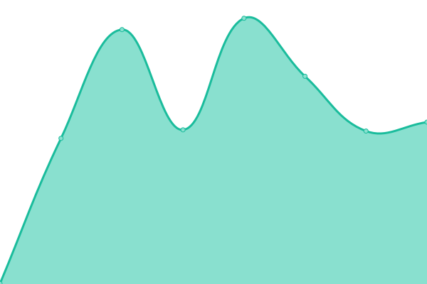

# [📈 Live Status](https://hervormdputten.github.io/status): <!--live status--> **🟩 All systems operational**

This repository contains the open-source uptime monitor and status page for [Hervormde Gemeente Putten](https://www.hervormdputten.nl), powered by [Upptime](https://github.com/upptime/upptime).

With [Upptime](https://upptime.js.org), you can get your own unlimited and free uptime monitor and status page, powered entirely by a GitHub repository. We use [Issues](https://github.com/HervormdPutten/status/issues) as incident reports, [Actions](https://github.com/HervormdPutten/status/actions) as uptime monitors, and [Pages](https://demo.upptime.js.org) for the status page.

<!--start: status pages-->
<!-- This summary is generated by Upptime (https://github.com/upptime/upptime) -->
<!-- Do not edit this manually, your changes will be overwritten -->
<!-- prettier-ignore -->
| URL | Status | History | Response Time | Uptime |
| --- | ------ | ------- | ------------- | ------ |
|  [HervormdPutten](https://www.hervormdputten.nl) | 🟩 Up | [hervormd-putten.yml](https://github.com/HervormdPutten/status/commits/HEAD/history/hervormd-putten.yml) | 

 776ms
     
 | 

<a href="https://HervormdPutten.github.io/status/history/hervormd-putten">100.00%</a>
    

|  [Toezeggingen](https://toezeggingen.hervormdputten.nl) | 🟩 Up | [toezeggingen.yml](https://github.com/HervormdPutten/status/commits/HEAD/history/toezeggingen.yml) | 

 802ms
     
 | 

<a href="https://HervormdPutten.github.io/status/history/toezeggingen">100.00%</a>
    

|  [IT Help](https://ithelp.hervormdputten.nl) | 🟩 Up | [it-help.yml](https://github.com/HervormdPutten/status/commits/HEAD/history/it-help.yml) | 

 277ms
     
 | 

<a href="https://HervormdPutten.github.io/status/history/it-help">100.00%</a>
    

|  [Check](https://check.hervormdputten.nl) | 🟩 Up | [check.yml](https://github.com/HervormdPutten/status/commits/HEAD/history/check.yml) | 

 546ms
     
 | 

<a href="https://HervormdPutten.github.io/status/history/check">100.00%</a>
    

<!--end: status pages-->

[**Visit our status website →**](https://hervormdputten.github.io/status)

## 📄 License

- Powered by: [Upptime](https://github.com/upptime/upptime)
- Code: [MIT](./LICENSE) © [Hervormde Gemeente Putten](https://www.hervormdputten.nl)
- Data in the `./history` directory: [Open Database License](https://opendatacommons.org/licenses/odbl/1-0/)
